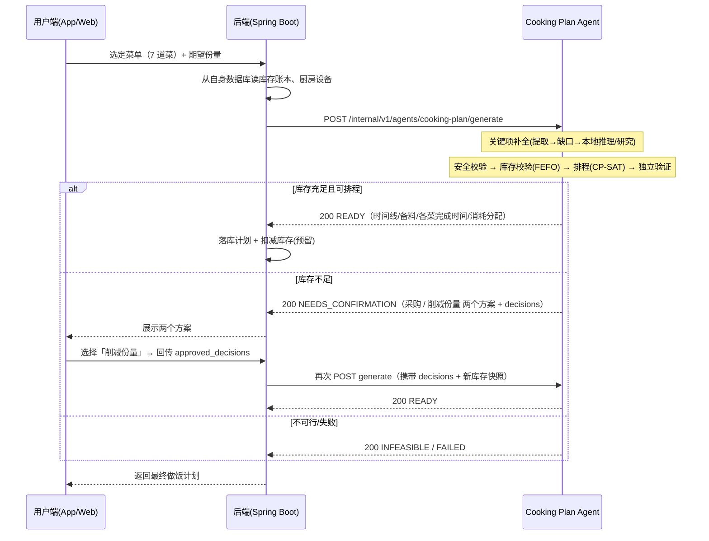

# 后端配合文档 — Cooking Plan Agent 集成指南

> 职责边界（本仓库的唯一约定）：
> **cooking-plan-agent 只负责「从结构化菜谱 + 库存/设备快照 → 生成做饭计划」**。
> 数据库读写、库存账本、用户会话/确认状态、购物清单持久化等**全部由后端（Spring Boot）承担**。
> 后端通过 HTTP 把所需数据以「快照」形式传给 agent，agent 完成计算后把计划与分配结果返回给后端，由后端落库。

---

## 1. 总体时序



- agent 是**无状态计算服务**：不建表、不维护库存账本，所有输入随请求携带。
- 确认循环的「状态」由后端持有：后端记住上次 `NEEDS_CONFIRMATION` 的 `plan_revision` 与 `decisions`，用户选择后原样回传。

---

## 2. 请求契约（原生端点）

**端点**：`POST /internal/v1/agents/cooking-plan/generate`（内部服务鉴权，见 §6）

```jsonc
{
  "request_id": "uuid",                 // 必填，幂等/追踪
  "user_id": "uuid",                    // 必填
  "recipes": [                          // 菜单：每道菜一个 RecipeInput
    {
      "recipe_id": "r1",
      "text": "食材准备\n主料：蟹脚\n…烹饪步骤…",   // 菜谱原文（含食材与步骤）
      "target_servings": 4              // 期望份量（Decimal>0）
    }
  ],
  "dietary_restrictions": [],
  "user_allergens": [],
  "time_limit_minutes": null,
  "cooking_date": "2026-08-02",
  "serving_at": null,
  "serving_time": null,
  "inventory_lots": [                   // 库存快照（后端从数据库读出后传入）
    { "lot_id": "l001", "item_id": "i001", "canonical_name": "蟹脚",
      "on_hand": "2000", "reserved": "0", "unit": "g",
      "expiry_date": "2026-08-20" }
  ],
  "kitchen_resources": [                // 厨房设备快照
    { "resource_id": "r1", "resource_type": "stove", "capacity": "2",
      "capacity_unit": "burners", "capabilities": ["gas"], "available": true }
  ],
  "approved_decisions": [],             // 用户确认后回传的决策（见 §4）
  "schema_version": "1.0",
  "plan_revision": null,                // 回传 decisions 时必带
  "region": "SG"                        // 可选；食品安全政策区域(ISO alpha-2)
}
```

| 字段 | 类型 | 说明 | 后端职责 |
|------|------|------|----------|
| `recipes[].text` | string | 菜谱原文；agent 负责解析出食材/步骤并补全关键项 | 透传用户输入的菜谱 |
| `target_servings` | Decimal>0 | 该菜份量，agent 按此缩放食材 | 由用户选择/后端计算 |
| `inventory_lots` | 快照数组 | 可用库存 + 已预留量 | **从后端库存表读取**，含 expiry_date 可做 FEFO |
| `kitchen_resources` | 快照数组 | 可用设备（stove/oven/sink/wok…） | 从后端设备表读取 |
| `approved_decisions` | 数组 | 用户对确认方案的选择 | 持久化并原样回传 |
| `region` | string | 食品安全政策区域 | 后端按用户/门店配置 |

> 兼容旧版 Java 调用方还有 **compat 端点** `POST /internal/v1/cooking-plans/generate`（`cooking-agent-v1` DTO：`candidates` 结构化菜谱快照 + `request.ingredients` 用户已有食材）。
> ⚠️ compat v1 只支持 `SUCCEEDED/FAILED`，**无法承载「采购/削减份量」交互确认**；要做完整确认闭环请使用原生端点（或升级契约 v2）。

---

## 3. 库存与设备数据要求（mock 参考）

- 数量用 **Decimal 字符串**（如 `"2000"`），严禁 float，避免精度问题。
- `reserved` 表示已被他计划预留的量，agent 按 `on_hand - reserved` 计算可用量；**后端需保证 `reserved <= on_hand`**。
- `canonical_name` 需与解析后食材名一致（大小写不敏感、忽略首尾空白）。agent 按名精确匹配做库存校验。
- 测试用充足库存与设备 fixture：`scripts/menu_fixtures.py`（`MOCK_INVENTORY` / `MOCK_KITCHEN_RESOURCES`），e2e 脚本会按需自动补足。

---

## 4. 响应契约

**所有业务结果均以 HTTP 200 返回**（协议错误除外），`status` 区分四种：

| status | 含义 | 关键字段 | 后端动作 |
|--------|------|----------|----------|
| `READY` | 计划生成成功 | `execution_flow[]`（任务依赖/解锁关系）、`mise_en_place[]`（备料）、`timeline[]`（仅预估参考）、`dish_completions[]`、`completion_checklist[]`、`explanation` | 落库计划、按 `completion_checklist` 预留库存 |
| `NEEDS_CONFIRMATION` | 需用户确认 | `repair_options[]`、`decisions[]`（可回传决策）、`confirmation_questions[]`、`plan_revision` | 展示方案、暂存，等待用户选择 |
| `INFEASIBLE` | 不可行 | `reasons[]` | 提示用户调整菜单/份量 |
| `FAILED` | 内部失败 | `error_code`、`correlation_id` | 记录日志、重试或降级 |

**NEEDS_CONFIRMATION 的两个必选方案**（库存不足时同时给出）：
1. **外出采购短缺食材** → `repair_options[].option_type == "purchase"`（含短缺清单：食材/缺口数量/单位）。
2. **按现有库存削减制作份量** → `option_type == "reduce_servings"`（含建议份量：`from N to M`）。

用户选择后，后端把对应 `decision` **原样**放入下一次请求的 `approved_decisions` 并带上 `plan_revision` 重发请求；agent 会按决策重新执行（削减份量→缩放食材→重校验→READY）。`purchase` 决策当前走「后端更新库存后重提请求」路径（agent 侧结构化确认暂不支持，见 §7 已知限制）。

---

## 5. 异步任务（长耗时菜单）

当菜单较大（如 7 道菜、分钟级求解）建议走异步：

- `POST /internal/v2/cooking-plan/tasks` → `202 {task_id, location}`（幂等：同一 `request_id` 同 payload 返回同任务）
- `GET /internal/v2/cooking-plan/tasks/{id}` → 轮询状态/结果
- `GET /internal/v2/cooking-plan/tasks/{id}/events` → SSE 进度（`event: progress/done`，支持 `Last-Event-ID` 续传）
- `POST /internal/v2/cooking-plan/tasks/{id}/cancel` → 协作取消
- 需后端配置 `COOKING_PLAN_TASK_API_ENABLED=true` 启用。

### 5.1 实时做饭执行流

生成任务进入 `READY` 后，Android/Web 以任务 API 的 `task_id` 驱动做饭，不应以 `timeline` 的分钟数强制用户操作：

- `GET /internal/v2/cooking-plan/tasks/{id}/execution`：读取当前可执行、进行中、已完成与被阻塞任务。
- `POST /internal/v2/cooking-plan/tasks/{id}/execution`：提交 `{ "cooking_task_id", "status": "IN_PROGRESS" | "COMPLETED", "expected_event_id" }`，响应返回下一批可执行任务。

`expected_event_id` 来自上一次响应，用于避免 Android 与 Web 同时操作时覆盖状态；收到 `409 EXECUTION_STATE_CONFLICT` 时重新 GET 后再展示。服务会校验前置依赖、单人主动操作冲突及已声明的设备容量。被动任务（烧水、焖煮、腌制）进行时，不会阻止处理虾等无依赖的主动任务。

---

## 6. 鉴权与可观测性

- **内部服务鉴权**：原生/任务端点用 `X-Internal-Token`（`COOKING_PLAN_INTERNAL_SERVICE_TOKEN`）；compat 端点用 `Authorization: Bearer <token>`。
- **关联 ID**：请求头 `X-Request-ID`；响应头回传，用于日志串联与 `correlation_id`。
- **背压**：高并发时返回 `503 + Retry-After`，后端应退避重试。
- **CORS**：默认关闭，内部调用无需 CORS。

---

## 7. 已知限制（后端需要知悉）

| # | 限制 | 影响与建议 |
|---|------|-----------|
| 1 | compat v1 端点把 `NEEDS_CONFIRMATION`/`INFEASIBLE` 折叠为 `FAILED` | 交互闭环请用原生端点；或升级契约 v2 |
| 2 | `purchase` 方案暂不支持结构化确认回传 | 用户选采购后：后端更新库存 → 重提请求（带新 `inventory_lots`） |
| 3 | READY 的 `completion_checklist`（库存消耗分配）当前恒为空（已知缺陷） | 后端暂不能据其扣库存；修复后本表移除该行 |
| 4 | 规则解析器对「适量/少许/括号备注」的提取质量有限 | 生产建议开启 LLM 解析（`COOKING_PLAN_LLM_ENABLED=true`）或用结构化 candidates |

---

## 8. 联调与测试

| 资源 | 说明 |
|------|------|
| `scripts/menu_fixtures.py` | 7 道菜菜单 + mock 库存（充足）+ mock 设备（单一数据源） |
| `scripts/e2e_menu_plan.py` | 直连 workflow：展示关键项补全 + 计划生成（READY/确认） |
| `scripts/test_recipes.py` | HTTP 冒烟脚本（需本地起服务） |

本地验证（在 `agent-service/app/agents/cooking` 下）：

```bash
COOKING_PLAN_INTERNAL_SERVICE_TOKEN=test uv run python scripts/e2e_menu_plan.py
PYTHONPATH=src uv run uvicorn cooking_plan_agent.main:app --host 127.0.0.1 --port 8000
COOKING_PLAN_INTERNAL_SERVICE_TOKEN=test uv run python scripts/test_recipes.py
```

> 补充：7 道菜单实测通过（关键项补全 + READY 计划）。过程中发现并修复了一个排程缺陷：
> 「Phase 3 超时回退时 `optimization_phases` 仍记录 `context_switch` → 验证器误拒 → 本可 READY 的计划变 FAILED」，
> 已修复于 `scheduling/orchestrator.py` 并加回归测试（`tests/unit/scheduling/test_multi_objective.py`）。
