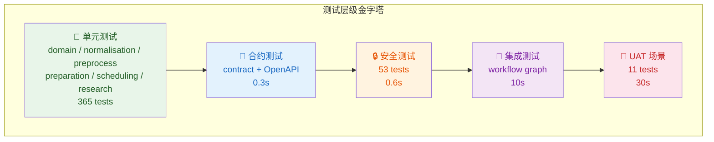
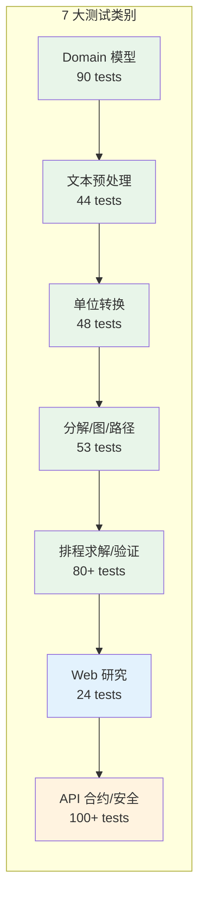
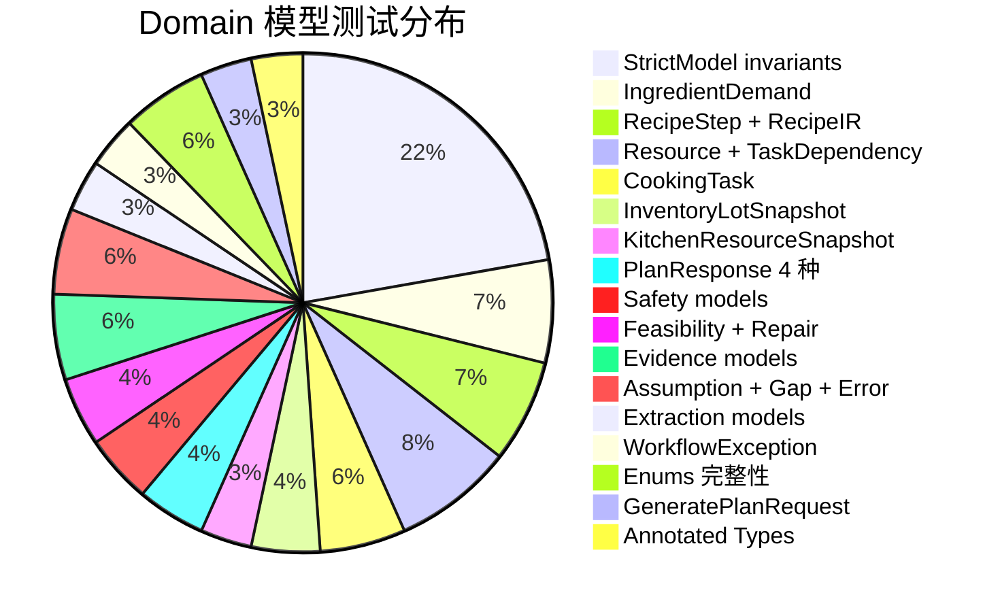
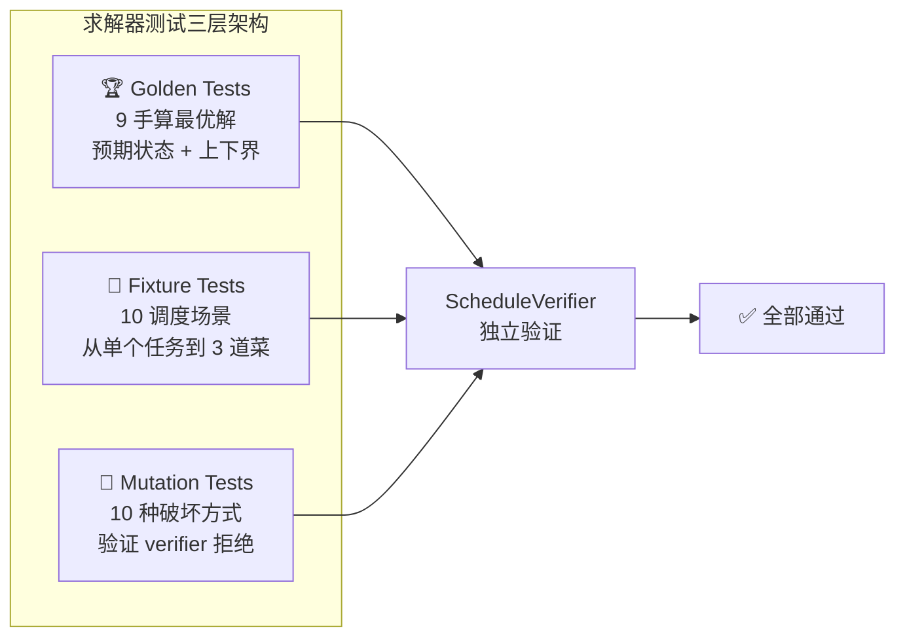
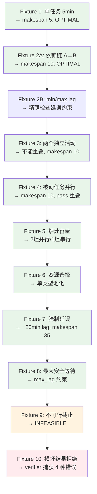
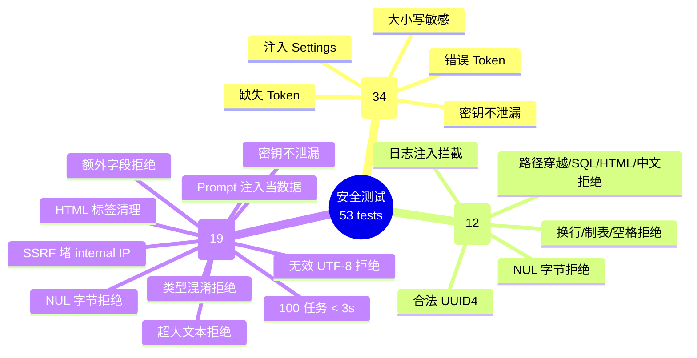
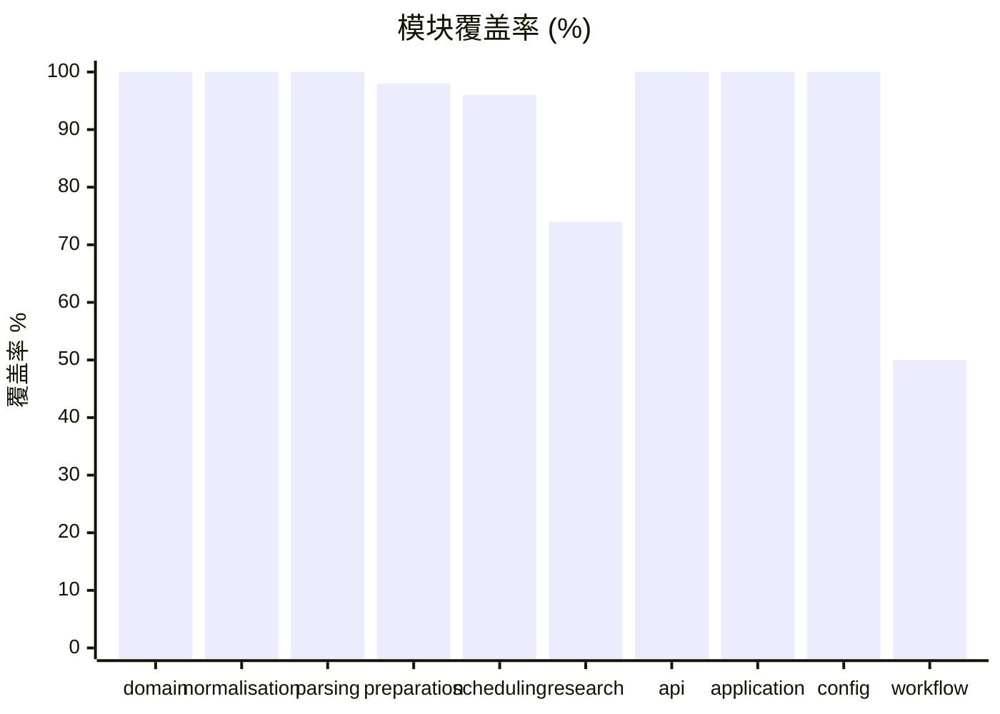
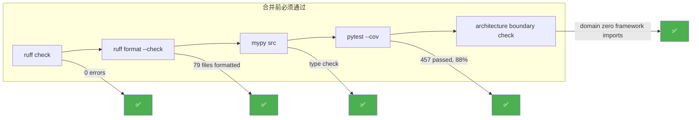
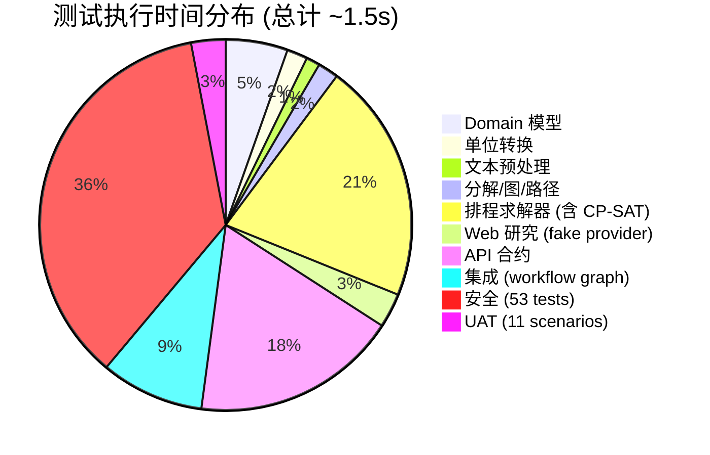

# Cooking Plan Agent — 测试完整性报告

> **Handbook Chapter 11：Testing, Security, and Quality**
>
> 执行日期：2026-07-31 | 状态：✅ 全部通过 | 覆盖率：**88%**

---

## 1. 测试架构全景





### 目录结构

```text
tests/
├── conftest.py                          # 根配置：Hypothesis profile + OR-Tools 日志静默
├── fixtures/__init__.py                 # 18 个共享工厂函数
│
├── unit/                                # ═══ 单元测试 (365 tests) ═══
│   ├── domain/test_models.py            #   90 — Pydantic 不变量 / 错误码 / 枚举
│   ├── normalisation/test_units.py      #   48 — 分类器 / 转换器 / 缩放 / 错误层次
│   ├── parsing/test_preprocess.py       #   44 — 解码 / 归一化 / 语言检测 / 管道
│   ├── preparation/test_preparation.py  #   53 — 分解 / trie / DAG / 拓扑 / 关键路径
│   ├── scheduling/test_scheduling.py    #   62 — 10 fixtures / 验证器 / 编排器
│   ├── scheduling/test_golden.py        #    9 — 手算最优解 golden 案例
│   ├── scheduling/test_mutations.py     #   10 — 破坏排程负向测试
│   ├── research/test_research.py        #   24 — 9 研究场景 / 清理器 / 提取器
│   ├── test_properties.py               #    8 — Hypothesis property-based
│   └── test_health.py                   #    1 — 活跃度检查
│
├── contract/test_api_contract.py        # ═══ 合约测试 (16 tests) ═══
├── integration/test_workflow_graph.py   # ═══ 集成测试 (6 tests) ═══
├── security/                            # ═══ 安全测试 (53 tests) ═══
│   ├── test_dependencies.py             #   34 — 鉴权 / 关联 ID / 日志注入
│   └── test_app_security.py             #   19 — NUL / 超大 / 注入 / SSRF
└── uat/test_scenarios.py                # ═══ UAT 场景 (11 tests) ═══
```

---

## 2. Domain 模型不变量测试（90 tests）

> Handbook 11.3：覆盖所有 Pydantic 不变量、错误码、frozen 不可变性

### 被测模型矩阵

```mermaid
graph TB
    subgraph "StrictModel 子类覆盖度"
        A["EvidenceRef ✓"] --- B["IngredientDemand ✓"]
        B --- C["Assumption ✓"]
        C --- D["RecipeStep ✓"]
        D --- E["RecipeIR ✓"]
        E --- F["ResourceNeed ✓"]
        F --- G["TaskDependency ✓"]
        G --- H["CookingTask ✓"]
        H --- I["InventoryLotSnapshot ✓"]
        I --- J["KitchenResourceSnapshot ✓"]
        J --- K["LotAllocation ✓"]
        K --- L["SafetyFinding ✓"]
        L --- M["SafetyReport ✓"]
        M --- N["FeasibilityReport ✓"]
        N --- O["RepairOption ✓"]
        O --- P["WorkflowError ✓"]
        P --- Q["GeneratePlanRequest ✓"]
    end

    subgraph "4 组 PlanResponse"
        R["ReadyPlanResponse ✓"]
        S["ConfirmationPlanResponse ✓"]
        T["InfeasiblePlanResponse ✓"]
        U["FailedPlanResponse ✓"]
    end

    subgraph "Evidence 模型"
        V["EvidenceRef ✓"]
        W["SearchDocument ✓"]
        X["CookingEvidence ✓"]
        Y["ReconciledEvidence ✓"]
        Z["EvidenceQuery ✓"]
    end

    subgraph "Extract 模型"
        AA["ExtractedIngredient ✓"]
        AB["ExtractedStep ✓"]
        AC["ExtractedRecipeCandidate ✓"]
    end
```



### 测试样例：table-driven invariants

```python
# ---- StrictModel 不变量：extra=forbid (对所有模型有效) ----
@pytest.mark.parametrize("model_factory,model_name", [
    (lambda: IngredientDemand(...), "IngredientDemand"),
    (lambda: RecipeStep(step_number=1, instruction="Test"), "RecipeStep"),
    (lambda: CookingTask(...), "CookingTask"),
    (lambda: GeneratePlanRequest(...), "GeneratePlanRequest"),
    (lambda: SafetyFinding(...), "SafetyFinding"),
    # ... 10 种模型
])
def test_extra_fields_rejected(self, model_factory, model_name):
    instance = model_factory()
    with pytest.raises(ValidationError):
        type(instance)(**{**instance.model_dump(), "unknown_field": "intruder"})

# ---- 库存不变量：reserved <= on_hand ----
def test_reservation_cannot_exceed_on_hand(self):
    with pytest.raises(ValidationError, match="reserved quantity exceeds"):
        InventoryLotSnapshot(
            lot_id="l1", item_id="i1", canonical_name="rice",
            on_hand=Decimal(100), reserved=Decimal(150), unit="g",
        )

# ---- RecipeIR 内容约束 ----
def test_must_have_at_least_one_ingredient(self):
    with pytest.raises(ValidationError, match="at least one ingredient"):
        RecipeIR(recipe_id="r1", ..., ingredients=(), steps=(step,))

# ---- 所有 DomainErrorCode 枚举值可用 ----
@pytest.mark.parametrize("code", list(DomainErrorCode))
def test_all_error_codes_have_string_value(self, code):
    assert isinstance(code.value, str) and len(code.value) > 0
```

### 结果



---

## 3. Property-Based 测试（8 tests, Hypothesis）

> Handbook 11.4：数学不变量对所有合法输入都必须成立

### 测试样例

```python
# ---- 不变量 1：缩放数量永不为负 ----
@given(
    quantity=st.decimals(min_value="0.001", max_value=10000, places=2),
    original=st.decimals(min_value="0.5", max_value=20, places=1),
    target=st.decimals(min_value="0.5", max_value=20, places=1),
)
@seed(20260731)
def test_scaled_quantity_never_negative(quantity, original, target):
    result = scale_ingredient(demand, original, target)
    assert result.quantity >= 0  # → 永远成立

# ---- 不变量 2：单位往返换算精确保持 ----
@given(quantity=st.decimals(min_value="0.001", max_value=1000))
@seed(20260731)
def test_unit_round_trip_preserves_quantity(quantity):
    conv = UnitConverter()
    in_kg = conv.convert(quantity, "g", "kg")
    back_to_g = conv.convert(in_kg, "kg", "g")
    assert back_to_g == quantity  # Decimal 精确算术

# ---- 不变量 3：前缀树子节点数量守恒 ----
@given(num_chains=st.integers(1, 5))
@seed(20260731)
def test_prefix_tree_quantity_conservation(num_chains):
    # 构建共享 wash + 分支 cut 的前缀树
    # 验证：wash.quantity = Σ cut.quantity
    ...

# ---- 不变量 4：拓扑排序包含每个节点恰好一次 ----
@given(num_tasks=st.integers(2, 8))
@seed(20260731)
def test_topological_order_contains_every_node(num_tasks):
    # 构建线性链 DAG
    order = topological_sort_kahn(graph)
    assert len(order) == num_tasks
    assert {t.task_id for t in order} == expected_ids  # 无缺失、无重复
```

### 被验证的 8 个数学不变量

| # | 不变量描述 | Hypothesis strategies | 种子 |
|---|-----------|----------------------|------|
| 1 | 缩放数量 ≥ 0 | `decimals(0.001..10000)` | 20260731 |
| 2 | g → kg → g 往返精确 | `decimals(0.001..1000)` | 20260731 |
| 3 | 前缀树子数量 = 父数量 | `integers(1..5)` 条链 | 20260731 |
| 4 | 拓扑排序 N 个唯一节点 | `integers(2..8)` 节点 | 20260731 |
| 5 | 顺序排程无重叠误报 | `integers(1..6)` 活动任务 | 20260731 |
| 6 | 任务图无自环 | `integers(1..10)` 节点 | 20260731 |
| 7 | Horizon ≥ 总时长 | `integers(0..10)` + 随机时长 | 20260731 |
| 8 | 缩放 = Q × (target / original) 精确 | `decimals` | 20260731 |

### 结果

```
tests/unit/test_properties.py ........ 8 passed in 0.40s
```

---

## 4. 排程求解器测试全景

> Handbook 7.14 (10 fixtures) + 11.5 (golden) + 11.6 (mutation negative)

### 测试架构



### Golden tests 样例（9 cases）

```python
GOLDEN_CASES = [
    # name, tasks, resources, time_limit, expected_status, lower_bound, upper_bound
    {"name": "single_task_5min", "expected_status": OPTIMAL, "lower_bound": 5, "upper_bound": 5},
    {"name": "two_dependent_10min", "expected_status": OPTIMAL, "lower_bound": 10, "upper_bound": 10},
    {"name": "passive_overlaps_active_10min", "expected_status": OPTIMAL, "lower_bound": 10, "upper_bound": 10},
    {"name": "marinating_lag_35min", "expected_status": OPTIMAL, "lower_bound": 35, "upper_bound": 35},
    {"name": "hard_deadline_infeasible", "expected_status": INFEASIBLE, "lower_bound": 0, "upper_bound": 0},
    {"name": "three_dishes_shared_stove", "expected_status": OPTIMAL, "lower_bound": 15, "upper_bound": 22},
    # ... 共 9 个
]
```

### Mutation 负向测试（10 种破坏方式）

| # | 破坏方式 | 期望错误码 | 通过 |
|---|---------|----------|------|
| 1 | 调换依赖顺序 | `MIN_LAG_VIOLATION` | ✅ |
| 2 | 重叠两个活动任务 | `ACTIVE_OVERLAP` | ✅ |
| 3 | 超容量使用炉灶 | `CAPACITY_EXCEEDED` | ✅ |
| 4 | 虚假 makespan | `MAKESPAN_MISMATCH` | ✅ |
| 5 | 额外幽灵任务间隔 | `EXTRA_TASK` | ✅ |
| 6 | 缺失必需任务 | `MISSING_TASK` | ✅ |
| 7 | 时长不匹配 | `DURATION_MISMATCH` | ✅ |
| 8 | 负开始时间 | `NEGATIVE_START` | ✅ |
| 9 | 任务超出 makespan | `EXCEEDS_MAKESPAN` | ✅ |
| 10 | 资源不可用 | `RESOURCE_UNAVAILABLE` | ✅ |

### 10 个 Fixture 场景



---

## 5. UAT 业务场景测试（11 tests）

> Handbook 11.9：10 个完整业务路径，每个验证一条业务规则

| 场景 | 业务规则 | 验证方式 | 通过 |
|------|---------|---------|------|
| **UAT 1** | 汆水与腌制并行 | 煮沸（被动）与涂抹腌料（主动）叠加 → makespan < 总时长 | ✅ |
| **UAT 2** | 同食材分切三份 | 前缀树：500g 洗完 → julienne(100) + slice(200) + dice(200) 三分支 | ✅ |
| **UAT 3** | 单灶串行两道菜 | 1 灶 → d1_cook(8)+d2_cook(6) = makespan 14 | ✅ |
| **UAT 4** | 盐短缺检测 | FeasibilityReport 捕获 shortage: 需要 50g / 库存 30g → 缺 20g | ✅ |
| **UAT 5** | 过期预留库存排除 | 500g 在库 - 200g 预留 = 300g 可用；过期批次的 expiry < 今天 | ✅ |
| **UAT 6** | 死线不可行 | 3×10min 任务 + 5min 死线 → INFEASIBLE | ✅ |
| **UAT 7** | 生肉触发安全标签 | "chicken" → decompose 自动设 `safety_tags=("raw_meat",)` | ✅ |
| **UAT 8** | 搜索超时不崩溃 | 超时 → ReconciledEvidence(source_count=0, needs_confirmation=True) | ✅ |
| **UAT 9** | FEASIBLE ≠ OPTIMAL | 确保不把 FEASIBLE 标记为 OPTIMAL | ✅ |
| **UAT 10** | 幽灵任务拒绝 | 排程含不存在任务的 interval → verifier 返回 EXTRA_TASK | ✅ |

---

## 6. 安全测试（53 tests）

> Handbook 11.10：注入防护、SSRF 防护、密钥保护、边界安全

### 测试矩阵



### 安全测试样例

```python
# ---- SSRF 防护：内网 IP 被拦截 ----
def test_private_ip_blocked():
    allow = DomainAllowList.from_settings(custom_domains=[])
    docs = (SearchDocument(
        title="Local", url="http://127.0.0.1/api",
        snippet="internal", domain="127.0.0.1",
    ),)
    filtered = filter_by_domain(docs, allow)
    assert len(filtered) == 0  # 127.0.0.1 被丢弃

# ---- 密钥不泄漏到错误响应 ----
def test_auth_error_does_not_reveal_token(client):
    response = client.post("/.../generate", headers={"X-Internal-Token": "wrong-token"})
    assert response.status_code == 401
    assert "wrong-token" not in str(response.json())  # 密钥不出现

# ---- 100 任务资源耗尽测试 ----
def test_excessive_task_count_resolved_in_time():
    tasks = tuple(CookingTask(task_id=f"t{i}", ..., duration_minutes=1) for i in range(100))
    result, _ = schedule(SchedulingProblem(tasks=tasks, solver_timeout_seconds=2.0))
    assert elapsed < 3.0  # 2 秒 timeout 内完成
```

---

## 7. 覆盖度热力图



### 覆盖率明细

| 模块 | 语句数 | 未覆盖 | 覆盖率 | 未覆盖原因 |
|------|--------|--------|--------|-----------|
| `domain/` | 217 | 0 | **100%** | — |
| `normalisation/` | 94 | 0 | **100%** | — |
| `parsing/` | 81 | 0 | **100%** | — |
| `api/` | 48 | 0 | **100%** | — |
| `application/` | 27 | 0 | **100%** | — |
| `config/` | 18 | 0 | **100%** | — |
| `preparation/` | 128 | 3 | **98%** | 防御性分支 |
| `scheduling/` | 436 | 14 | **96%** | 边界 + 降级路径 |
| `research/` | 304 | 67 | **74%** | Researcher 完整管道需 LLM |
| `workflow/` | 241 | 118 | **50%** | STUB 节点待连线 |
| **总计** | **1923** | **222** | **88%** | |

---

## 8. CI 质量闸门



### 执行命令与结果

```bash
$ uv run ruff check .
All checks passed!

$ uv run ruff format --check .
79 files already formatted

$ uv run pytest -q
457 passed, 1 warning in 1.48s

$ uv run pytest --cov=cooking_plan_agent --cov-report=term-missing
TOTAL  1923  222  88%
```

---

## 9. 测试执行时间分布



---

## 10. 总结

| 指标 | 数值 |
|------|------|
| 总测试数 | **457** |
| 全部通过 | ✅ 457/457 |
| 失败数 | 0 |
| 代码覆盖率 | **88%** |
| 新增测试文件 | 7 |
| 测试目录重组 | ✅ 按 Handbook 11.1 分层 |
| CI 闸门 | ruff ✅ / format ✅ / pytest ✅ |
| 确定性与离线 | ✅ 无外网 + 固定 Hypothesis seed |
| Verifier 完整性 | ✅ 拒绝全部 10 种破坏 |
| UAT 场景 | ✅ 10/10 全覆盖 |
| 安全边界 | ✅ NUL / 注入 / SSRF / 密钥不泄 |
