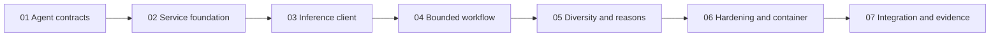

# Recommendation Agent Implementation Hand-off

- **Status:** Proposed
- **Target repository:** `foodmind-intelligence`
- **Audited target revision:** `87e1d7606e8bee6b91cf8cfc46f206ffeadabbfe`
- **Source baseline date:** 3 August 2026
- **Scope:** dedicated Recommendation Agent only

## Purpose

This package turns the approved Recommendation Agent design into ordered,
branch-sized implementation hand-offs. A coding agent should be able to execute
one numbered plan at a time without guessing or moving Backend, inference, ML,
database, public API, or client ownership into the Agent module.

Inference is an external private dependency consumed through a frozen contract.
This package does not plan or implement the inference runtime, model loading,
UserCF/ItemCF/LR computation, model packages, training, evaluation, datasets, or
release tooling.

## Authority and source references

Read completely before implementation:

1. `foodmind-docs/architecture/recommendation-document-inventory.md`
2. `foodmind-docs/architecture/recommendation-system-implementation-design.md`
3. `foodmind-docs/planning/recommendation-system-delivery-plan.md`

Apply the inventory's authority order. Agent-relevant repository sources are:

- `docs/architecture/runtime-architecture.md`
- the implemented generic service/graph patterns under
  `agent-service/app/agents/cooking/`
- Backend consumer plans 10-12 and fixtures under
  `foodmind-backend/src/test/resources/contracts/agent/recommendation/`

`docs/operations/model-consumption.md` and `inference-service/` are external
dependency context only for this package.

## Plan-file contract

Each numbered file is one reviewable implementation branch with:

1. metadata and dependency gates;
2. purpose, scope, and explicit non-scope;
3. source-document sections;
4. contracts/configuration;
5. concrete files;
6. ordered module/class/function tasks;
7. unit, contract, integration, security, and container tests;
8. acceptance criteria;
9. commits, commands, hand-off, and rollback; and
10. assumptions/conflicts/unresolved questions.

`Proposed` identifies a concrete choice not yet confirmed by source or code.
`Unresolved` is a gate that dependent work must not decide silently.

## Fixed boundaries

- Spring Boot is the only public, authentication, authorisation, persistence,
  hard-filter, feedback, and final-validation boundary.
- Recommendation is a dedicated bounded workflow, never Chatbot/Cooking/Search.
- Agent input contains only authorised, already eligible candidates.
- Agent cannot add candidates or relax filters.
- Agent calls the configured inference service exactly once and performs no
  other tool, database, web, filesystem, or code-execution access.
- Agent does not implement or understand training/model-package internals.
- Any timeout, unavailable dependency, invalid response, incompatible version,
  unsupported reason, or unsafe output becomes a typed failure so Backend uses
  deterministic fallback.
- At most 100 candidates enter and at most three unique ordered results leave.
- Deterministic templates are the MVP explanation path; no LLM is required and
  ranking never depends on one.

## Ordered hand-offs

1. [Freeze Agent contracts and golden fixtures](01-agent-contracts-and-golden-fixtures.md)
2. [Create the private Agent service foundation](02-agent-service-foundation.md)
3. [Add the one-call inference client and deadline budgets](03-inference-client-and-deadlines.md)
4. [Implement the bounded acyclic workflow](04-bounded-agent-workflow.md)
5. [Implement diversity, grounded reasons, and output](05-diversity-reasons-and-output.md)
6. [Harden, observe, test, and containerise the Agent](06-agent-hardening-and-container.md)
7. [Prove Backend integration, shadow readiness, and rollback](07-agent-integration-and-release-evidence.md)

See [requirements-traceability.md](requirements-traceability.md) for current
state, complete coverage, dependencies, and unresolved gates.

## Dependency order



Do not start code against draft contract fields. Inference and Backend may be
implemented in parallel by their owners after Plan 01, but this package plans
only the Agent consumer/producer work.

## Proposed repository layout

Use the only implemented Agent convention: an isolated nested Python project.

```text
foodmind-intelligence/
  agent-service/app/agents/recommendation/
    pyproject.toml
    uv.lock
    src/recommendation_agent/
    tests/
  contracts/internal/agent/recommendation/v2/
  contracts/internal/inference/recommendation/v1/consumer-fixtures/
  contracts/internal/shared/recommendation-features/v2/
  artifacts/test-fixtures/recommendation/agent-golden-v2/
  deployment/docker/
  deployment/local/
  docs/planning/recommendation-agent/
```

The parent Recommendation directory and contract directories are verified;
new child files are `Proposed`. The external `inference-service/` is unchanged
by these plans.

## Definition of done

- Agent v2 plus inference-consumer coordination schemas/fixtures are frozen and
  checksum-linked to canonical owners.
- Strict private API/auth/correlation/payload/error behavior is tested.
- Absolute deadline becomes a local monotonic budget with an accepted guard.
- One inference call is the Agent's only capability; invalid responses fail
  closed without retry.
- Graph is acyclic, bounded, serializable, deterministic, and has one terminal
  success/failure.
- Up to three unique results obey frozen lead/diversity/group policies.
- Every reason satisfies the frozen predicate; templates are bounded and safe.
- Logs/metrics contain no credential, raw ID, model key, full feature, or body.
- Root CI and non-root container pass contract/security/smoke gates.
- Backend-to-Agent and Agent-to-inference consumer fixtures pass.
- Normal, cold-start, sparse-group, timeout, malformed, incompatible, unsafe,
  fallback, and rollback evidence is retained.
- No inference, ML, model-package, database, public API, or client source is
  added by this workstream.

## Branch and merge convention

- Branch from current canonical `main`.
- Keep commits independently green and stage only named paths.
- Use Conventional Commit scopes in each plan.
- Squash-merge after focused/full gates.
- Roll back by disabling Backend Agent v2 or deploying the prior Agent image;
  Backend deterministic fallback stays enabled.

